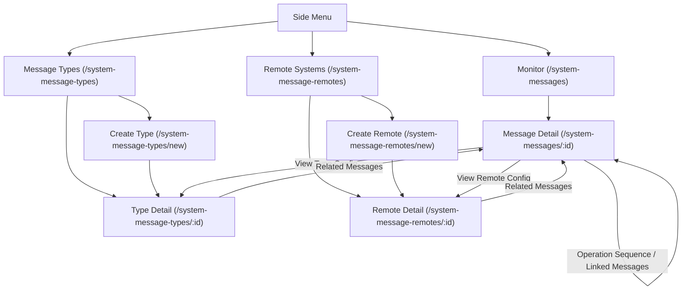

# System Messages

Implementation document for monitoring, configuring, and replaying system messages.

## Overview

System Messages covers three related areas:

1. **Monitor**: Global inbox of individual messages across all message types and remotes.
2. **Message Types**: Catalog and CRUD flows for `SystemMessageType`.
3. **Remote Systems**: Catalog and CRUD flows for `SystemMessageRemote`.

This module uses real Moqui status IDs such as `SmsgSent`, `SmsgConsumed`, and `SmsgError`. UI labels and colors are derived from the exported `statuses` data for `statusTypeId === "SystemMessage"`.

## Route Structure

- `/system-messages`: [Monitor](file:///Users/adityapatel/Documents/GitHub/accxui/apps/job-manager/src/views/SystemMessageMonitor.vue)
- `/system-messages/:id`: [Message Detail](file:///Users/adityapatel/Documents/GitHub/accxui/apps/job-manager/src/views/SystemMessageDetailView.vue)
- `/system-message-types`: [Message Types Catalog](file:///Users/adityapatel/Documents/GitHub/accxui/apps/job-manager/src/views/SystemMessageTypes.vue)
- `/system-message-types/new`: [Create Message Type](file:///Users/adityapatel/Documents/GitHub/accxui/apps/job-manager/src/views/SystemMessageTypeDetail.vue)
- `/system-message-types/:id`: [Edit Message Type](file:///Users/adityapatel/Documents/GitHub/accxui/apps/job-manager/src/views/SystemMessageTypeDetail.vue)
- `/system-message-remotes`: [Remote Systems Catalog](file:///Users/adityapatel/Documents/GitHub/accxui/apps/job-manager/src/views/SystemMessageRemotes.vue)
- `/system-message-remotes/new`: [Create Remote System](file:///Users/adityapatel/Documents/GitHub/accxui/apps/job-manager/src/views/SystemMessageRemoteDetail.vue)
- `/system-message-remotes/:id`: [Edit Remote System](file:///Users/adityapatel/Documents/GitHub/accxui/apps/job-manager/src/views/SystemMessageRemoteDetail.vue)

## Navigational Flow & Routing

The system message module is designed with highly interconnected views to facilitate seamless debugging and configuration.

### Connectivity Diagram

### Key Connections

1.  **Monitor to Detail**: The primary entry point for debugging. Clicking any message in the Monitor list navigates to the detailed view of that message.
2.  **Detail to Configuration**:
    *   From the **Message Detail** view, clicking on the "System Message Type" field navigates to the **Type Detail** page to inspect or modify the underlying configuration.
    *   Similarly, clicking on the "System Message Remote" field navigates to the **Remote System Detail** page.
3.  **Recursive Detail Navigation**:
    *   The **Message Detail** view supports deep-linking within its own route.
    *   **Operation Sequence**: For complex multi-step operations (like Shopify Bulk Query), users can click on previous or subsequent steps in the sequence flow to navigate directly to those related messages.
    *   **Linked Messages**: Displays explicit parent/child relationships, allowing users to traverse the message hierarchy.
4.  **Related Messages Back-linking**: Both the **Type Detail** and **Remote System Detail** views include a "Related Messages" section. These sections use the standard `SystemMessageList` component, which links back to the **Message Detail** for any listed message.

## Screen Definitions

### 1. Monitor

Global list of individual `SystemMessage` records.

**Required filters**
- Keyword search
- `systemMessageTypeId`
- `systemMessageRemoteId`
- `statusId`
- `parentTypeId` (derived from `systemMessageTypeId`)

### Parent Type Filtering

The Monitor supports filtering by **Parent Type**, which groups individual `SystemMessageType` records.

**Implementation Details**
- The frontend parses the unique `parentTypeId` values from the `SystemMessageType` catalog to populate the filter dropdown.
- When a Parent Type is selected, the application filters messages using an "in" operation across all `systemMessageTypeId` values belonging to that parent.
- Selecting a Parent Type automatically clears any specific `systemMessageTypeId` filter to ensure a valid result set.
- The `Message Type` filter is contextually updated to show only types belonging to the selected Parent Type.

**Technical Note: Performance and Large Datasets**
While the current implementation filters messages on the client-side (or mock layer) by resolving child types, the recommended approach for large production datasets is to use a **Moqui View Entity** (e.g., `SystemMessageAndType`) that joins `SystemMessage` with `SystemMessageType`. This allows the server to handle the `parentTypeId` filter directly at the database level, avoiding the overhead of "in" clause logic or client-side filtering.

**List behavior**
- Server-style pagination contract in the store and mock layer
- Message cards or rows show:
  - `systemMessageId`
  - `systemMessageTypeId`
  - `systemMessageRemoteId`
  - `statusId`
  - `initDate`
  - `processedDate`
  - direction from `isOutgoing`
- Clicking a row opens `/system-messages/:id`

### 2. Message Detail

Dedicated route for a single `SystemMessage`.

**Required sections**
- Metadata
- Raw message content
- Error history
- Replay actions

**Metadata fields**
- `systemMessageId`
- `systemMessageTypeId`
- `systemMessageRemoteId`
- `statusId`
- `isOutgoing`
- `initDate`
- `processedDate`
- `lastAttemptDate`
- `remoteMessageId` when present

**Content behavior**
- Pretty-print JSON when valid JSON
- Fall back to raw text for non-JSON payloads

**Error behavior**
- Fetch related `SystemMessageError` rows by `systemMessageId`
- Show `errorDate`, `attemptedStatusId`, and `errorText`

**Edit and replay rules**
- Any non-consumed message may be edited and replayed
- Message detail must expose all allowed transitions for the current state
- Replay targets are derived from status-flow metadata, not hardcoded in the view

### 3. Message Types Catalog

Catalog of `SystemMessageType` entities.

**Catalog behavior**
- Search by `systemMessageTypeId` and `description`
- Show status counts derived from message queries, not a dedicated summary endpoint
- Clicking a card opens `/system-message-types/:id`
- Create action opens `/system-message-types/new`

**Card content**
- `systemMessageTypeId`
- `description`
- related `systemMessageRemoteId` when present
- total counts for relevant message statuses

### 4. Message Type Detail

Combined config and related-messages view.

**Top section**
- Curated edit form for broad entity-field coverage
- `systemMessageTypeId` is editable only on create and immutable afterwards

**Lower section**
- Filtered list of related `SystemMessage` rows for this type
- Same status label/color rules as Monitor
- Related message rows link to `/system-messages/:id`

**Field policy**
- Include broad business/admin fields from the entity
- Exclude system-managed timestamps and similar low-value technical fields from forms

### 5. Remote Systems Catalog

Catalog of `SystemMessageRemote` entities.

**Catalog behavior**
- Search by `systemMessageRemoteId` and `description`
- Show status counts derived from related message queries
- Clicking a card opens `/system-message-remotes/:id`
- Create action opens `/system-message-remotes/new`

### 6. Remote System Detail

Combined config and related-messages view.

**Top section**
- Curated edit form for broad entity-field coverage
- `systemMessageRemoteId` is editable only on create and immutable afterwards

**Lower section**
- Filtered list of related `SystemMessage` rows for this remote
- Related message rows link to `/system-messages/:id`

**Sensitive field policy**
- Show secret-like values as masked editable fields
- Do not display raw secret values in list screens
- Fields such as `password`, `privateKey`, `sharedSecret`, and token-like values remain editable

## CRUD Rules

### Create and Edit

- Message Types and Remote Systems support dedicated create routes
- Edit uses curated forms, not a raw JSON entity editor
- Forms cover broad entity fields except immutable IDs and system-managed timestamps

### Delete

- Delete is allowed with guardrails
- A record cannot be deleted when it is referenced by related system messages or dependent configs

## API Contract

The frontend is built against entity-shaped Moqui data. Exported sample entity JSON is treated as the source contract for field names and shapes.

### System Message Types
- `GET /rest/s1/system/message/types`
- `POST /rest/s1/system/message/types`
- `PATCH /rest/s1/system/message/types/{id}`
- `DELETE /rest/s1/system/message/types/{id}`

### Remote Systems
- `GET /rest/s1/system/message/remotes`
- `POST /rest/s1/system/message/remotes`
- `PATCH /rest/s1/system/message/remotes/{id}`
- `DELETE /rest/s1/system/message/remotes/{id}`

### System Messages
- `GET /rest/s1/system/messages`
- `PATCH /rest/s1/system/messages/{id}`
- `GET /rest/s1/moqui/entities/moqui.service.message.SystemMessage/{systemMessageId}`

### System Message Errors
- `GET /rest/s1/moqui/entities/moqui.service.message.SystemMessageError`

## Specialized Operations

### Shopify Bulk Operations

Shopify Bulk Imports and Queries use a complex, asynchronous lifecycle defined by **Enumeration Sequences**. 

For a detailed breakdown of the Traceability Matrix, data linking, and interactive UI logic, refer to the [Shopify Bulk Operations Architecture](file:///Users/adityapatel/Documents/GitHub/accxui/apps/job-manager/docs/shopify-bulk-operations.md).

---

## Replay And Status Rules

System message replay is derived from exported status metadata.

### Canonical data sources

- `statuses` rows where `statusTypeId === "SystemMessage"` are the canonical system message statuses
- `moqui.basic.StatusFlowTransition` rows in the `Default` flow are the canonical transition graph for system messages
- Direction is determined by `SystemMessage.isOutgoing`

### Allowed transitions

- The app must derive the full set of allowed next transitions for the current `statusId`
- The app must not assume a single hardcoded replay target for every message

### Replay transitions

Replay actions are filtered from the full allowed-transition set using direction:

- Outgoing messages (`isOutgoing === "Y"`): replay targets are `SmsgProduced`, `SmsgSending`, and `SmsgSent`
- Incoming messages (`isOutgoing === "N"`): replay targets are `SmsgReceived`, `SmsgConsuming`, and `SmsgConsumed`

For example, a message in `SmsgError` may expose multiple replay options depending on direction and the flow graph.

## Mock Data Requirements

The mock layer is split by concern:

- entity mocks for:
  - `SystemMessageType`
  - `SystemMessageRemote`
  - `SystemMessage`
  - `SystemMessageError`
- status metadata mocks for:
  - `statuses`
  - `statusTypes`
  - `StatusFlow`
  - `StatusFlowTransition`

Replay selectors are derived from those raw mock exports in a utility or selector layer, not encoded directly inside the raw mock arrays.
